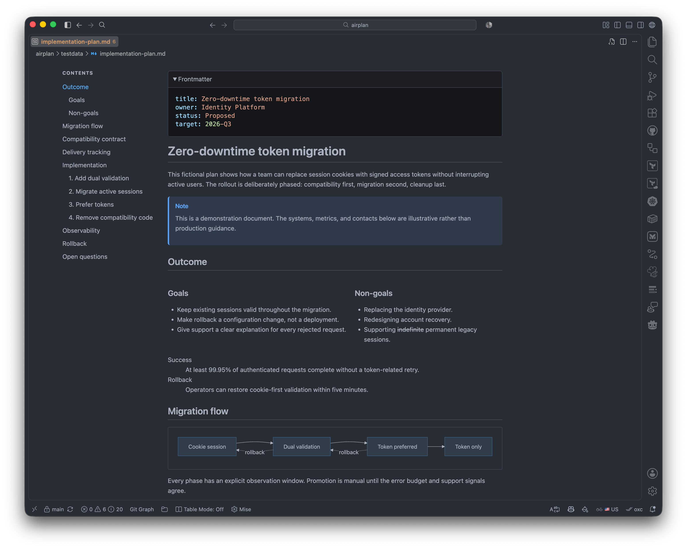

<div align="center">


# Better Markdown Preview

**A better, theme-aware Markdown preview for Visual Studio Code.**

[](https://github.com/jimeh/vscode-better-markdown-preview/releases/latest)
[][vscode-ext]
[][openvsx-ext]
[](https://github.com/jimeh/vscode-better-markdown-preview/issues)
[](https://github.com/jimeh/vscode-better-markdown-preview/pulls)
[](https://github.com/jimeh/vscode-better-markdown-preview/blob/main/LICENSE)

</div>

[vscode-ext]: https://marketplace.visualstudio.com/items?itemName=jimeh.better-markdown-preview
[openvsx-ext]: https://open-vsx.org/extension/jimeh/better-markdown-preview

Better Markdown Preview is a standalone, all-in-one enhancement for Visual
Studio Code's built-in Markdown preview. Its goal is to bring the common preview
features you would otherwise need several extensions for into one place,
without replacing the native preview. Source synchronization, resource
resolution, security settings, code-copy controls, syntax highlighting, and
user preview styles continue to work.



It adds:

- Complete visible GFM behavior, including task lists, literal autolinks, and
  tag filtering.
- A responsive H1-H3 table of contents with active-heading tracking.
- GitHub alerts, footnotes, definition lists, and collapsible highlighted TOML
  and YAML frontmatter.
- Responsive Pandoc-style columns.
- Improved, locally bundled Mermaid rendering with a full-page viewer for
  zooming and panning around large diagrams.
- Code-block titles, highlighted lines and words, line numbers, and diff-line
  annotations while retaining VS Code's native highlighter.
- A clean layout driven entirely by the active VS Code theme, including high
  contrast and print presentation.

Open a Markdown file and run **Markdown: Open Preview** or **Markdown: Open
Preview to the Side**. The built-in preview is enhanced automatically.

## Extended syntax

TOML frontmatter uses exact `+++` delimiter lines at the start of a document;
YAML uses `---`. Both render expanded by default in a collapsible,
syntax-highlighted code block without displaying their delimiter lines.
Columns use the supported Pandoc fenced-div subset:

```markdown
:::: {.columns}
::: {.column width=40%}
Left column
:::
::: {.column}
Right column
:::
::::
```

Rich code metadata follows the language identifier:

````markdown
```ts title="src/example.ts" {1,3-5} /needle/ showLineNumbers
const needle = true; // [!code ++]
```
````

Only an exact lowercase `mermaid` fence renders as a diagram. Mermaid is loaded
from the extension package only when the document contains such a block; source
remains visible if loading or rendering fails.

## Settings

All Better Markdown Preview features are enabled by default and can be changed
at user or workspace scope:

| Setting                                             | Behavior                                                       |
| --------------------------------------------------- | -------------------------------------------------------------- |
| `betterMarkdownPreview.rendering.taskLists`         | GFM task lists                                                 |
| `betterMarkdownPreview.rendering.definitionLists`   | Definition lists                                               |
| `betterMarkdownPreview.rendering.footnotes`         | Footnotes and backlinks                                        |
| `betterMarkdownPreview.rendering.githubAlerts`      | GitHub-style alerts                                            |
| `betterMarkdownPreview.rendering.tomlFrontmatter`   | Expanded, collapsible, highlighted TOML frontmatter            |
| `betterMarkdownPreview.rendering.yamlFrontmatter`   | Expanded, collapsible, highlighted YAML frontmatter            |
| `betterMarkdownPreview.rendering.columns`           | Responsive Pandoc-style columns                                |
| `betterMarkdownPreview.rendering.enhancedAutolinks` | Missing GFM HTTP, HTTPS, email, and `www.` literal links       |
| `betterMarkdownPreview.rendering.richCodeBlocks`    | Rich code-block metadata and diff annotations                  |
| `betterMarkdownPreview.rendering.mermaid`           | Local Mermaid fence rendering                                  |
| `betterMarkdownPreview.navigation.tableOfContents`  | Responsive table of contents and active-heading tracking       |
| `betterMarkdownPreview.navigation.smoothScrolling`  | Animated ToC navigation, subject to reduced-motion preferences |
| `betterMarkdownPreview.mermaid.viewer`              | Full-screen Mermaid zoom and pan viewer                        |

Disabling a rendering feature stops Better Markdown Preview from handling that
syntax and delegates it to VS Code or another Markdown extension. It does not
force the syntax to remain literal. Theme integration, accessibility, overflow
handling, print safety, and GFM tag filtering remain enabled because they are
baseline presentation, compatibility, and safety behavior.

## Development

[mise](https://mise.jdx.dev/) installs the locked runtime and validation tools.
The project uses three-day release-age policies for Mise tools and pnpm
dependencies.

```console
mise run setup
mise run check
mise run verify
```

Use `mise tasks` to discover the complete task surface. The most common loops
are:

- `mise run dev` watches the desktop, web, preview runtime, Mermaid, CSS, and
  TypeScript targets.
- `mise run check` runs the fast formatter, linter, type, and unit gate.
- `mise run lint` runs native and type-aware Oxlint, Stylelint, and Markdownlint.
- `mise run test:coverage` enforces all-files V8 coverage floors.
- `mise run test:desktop` exercises the engine floor and stable desktop hosts.
- `mise run test:web:stable` exercises stable VS Code for the Web in Chromium
  after `mise run test:hosts:prepare`.
- `mise run package:validate` builds and inspects the VSIX.
- `mise run release:check` exercises versioning, notes, outputs, and workflow
  contracts without publishing.
- `mise run verify` runs the intended-final-head local gate.

See [Architecture](docs/architecture.md) and [Testing](docs/testing.md) for the
contracts those commands enforce. See [Releases](docs/releases.md) for the
automated versioning, publication, and recovery contract.

## License

Better Markdown Preview is available under the [MIT License](LICENSE).
