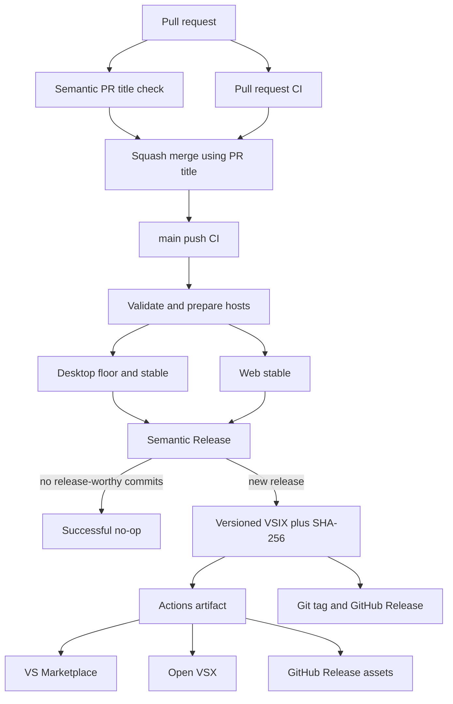

# Semantic Release Automation Plan

## Objective

Make every release-worthy commit that lands in `main` eligible for an
unattended release after the repository's complete CI contract passes. Derive
the version and release notes from Conventional Commits, produce one validated
VSIX, and publish that exact artifact to the Visual Studio Marketplace, Open
VSX, and the corresponding GitHub Release.

The initial automated release will be `v1.0.0`. The workflow must require no
release pull request, manual version selection, or routine maintainer action.

Canonical references:

- [Semantic Release](https://github.com/semantic-release/semantic-release)
- [Semantic Release GitHub Actions guidance](https://semantic-release.gitbook.io/semantic-release/recipes/ci-configurations/github-actions)
- [vscode-actionlint publication workflow](https://github.com/jimeh/vscode-actionlint/blob/main/.github/workflows/ci.yml)
- [vscode-glaze publication workflow](https://github.com/jimeh/vscode-glaze/blob/main/.github/workflows/ci.yml)
- [tmux-chroma semantic PR workflow](https://github.com/jimeh/tmux-chroma/blob/main/.github/workflows/semantic-pr.yml)
- [Hucode semantic PR workflow](https://github.com/jimeh/hucode/blob/main/.github/workflows/semantic-pr.yml)

## Settled Decisions

- Use the `semantic-release` package, not Release Please. Releases happen from
  `main` without a release PR.
- Run Semantic Release only after the exact pushed revision passes validation,
  the desktop engine-floor and stable host contracts, and the stable web-host
  contract.
- Allow the first untagged release to use Semantic Release's native `v1.0.0`
  bootstrap. Do not create a synthetic baseline tag.
- Treat Git tags, GitHub Releases, and marketplace versions as the published
  version sources of truth. Do not commit release versions back into
  `package.json`.
- Do not push generated release commits into `main`. In particular, do not use
  `@semantic-release/git` or `@semantic-release/npm`.
- Replace the current hand-authored changelog with a release-managed shell.
  Generate the current release's changelog in the release workspace before
  packaging, but do not commit it. GitHub Releases provide the cumulative
  historical record.
- Build one VSIX, validate it, checksum it, and fan out that exact artifact to
  all three publication targets.
- Keep publication targets independently retryable and restrict each job to the
  minimum credentials it needs.
- Use the repository's GitHub App for tag and GitHub Release creation through
  `RELEASE_BOT_CLIENT_ID` and `RELEASE_BOT_PRIVATE_KEY`.
- Use a separate semantic pull-request-title workflow. It is metadata-only,
  executes no pull-request code, and gives actionable sticky feedback.
- `docs` commits are release-worthy patch changes and appear in release notes.
- Require squash merging with the validated PR title as the squash commit
  title, so the commit analyzed on `main` has the same semantic contract that
  passed PR validation.
- Keep pull-request CI cancelable, but serialize `main` workflows and never
  cancel an in-progress release.

## Release Semantics

The release analyzer and PR-title validator must accept the same Conventional
Commit vocabulary:

- `feat`: minor release.
- `fix`, `perf`, and `revert`: patch release.
- `docs`: patch release and visible `Documentation` release-note section.
- Any accepted type carrying `!` or a `BREAKING CHANGE:` footer: major release.
- `build`, `chore`, `ci`, `refactor`, `style`, and `test`: accepted but not
  release-worthy unless they carry a breaking-change marker.

Scopes remain optional and unconstrained. The subject must not start with an
uppercase letter. Runtime dependency changes that should reach users must use a
release-worthy title such as `fix(deps): ...`; development-only dependency work
may remain `chore(deps-dev): ...`.

The release-notes configuration must explicitly keep documentation visible
while hiding non-user-facing maintenance sections. Do not assume the
`conventionalcommits` preset's default presentation: its default documentation
section is hidden.

## End-to-End Workflow



### Main and pull-request CI

- Preserve the existing `validate`, desktop-host matrix, and web-host jobs as
  the authoritative source and host compatibility evidence.
- Add a `release` job that runs only for pushes to `main` and needs both host
  consumers. Their dependency on `validate` makes the complete graph a release
  prerequisite without repeating broad validation.
- Change workflow concurrency so pull-request runs may cancel superseded runs,
  while `main` runs sharing the same branch concurrency group queue instead of
  canceling one another.
- The release job checks out the event SHA with complete Git history and tags.
  It must never replace the tested SHA with a later `main` head.

### Semantic Release lifecycle

Add a typed `release.config.mjs` or `release.config.mts` supported by Semantic
Release and the repository's tooling typecheck. Configure:

- Release branch: `main` only.
- Tag format: `v${version}`.
- `@semantic-release/commit-analyzer` with the Conventional Commits preset and
  an explicit `docs` patch rule.
- `@semantic-release/release-notes-generator` with sections matching the
  release contract above.
- `@semantic-release/changelog` with `CHANGELOG.md` and an exact
  `# Changelog` title.
- `@semantic-release/exec` to call the repository-owned release packaging task
  with `${nextRelease.version}`.
- `@semantic-release/github` to create the tag-associated GitHub Release and
  publish the generated notes. Disable routine success comments and release
  labels; retain a durable failure issue if the App's issue permission is
  available.

Add a small typed runner around Semantic Release's JavaScript API. It must:

- Return a successful `released=false` result when no release-worthy commits
  exist.
- Emit `released`, `version`, and `git_tag` step outputs after a successful
  release.
- Fail without fabricating outputs when Semantic Release throws.
- Never print credentials or token-bearing repository URLs.

Do not add a release action wrapper when the repository-owned runner can expose
the required outputs with less indirection.

## Changelog Contract

Replace the existing manually curated `Unreleased` content with:

```markdown
# Changelog

Release history is available in
[GitHub Releases](https://github.com/jimeh/vscode-better-markdown-preview/releases).
```

The configured title allows `@semantic-release/changelog` to insert release
notes without duplicating the heading. On the first run, Semantic Release has no
prior release tag, so `v1.0.0` notes are generated from the existing
Conventional Commit history. On later runs, the workspace changelog contains
the current release's changes since the previous tag.

The generated file is deliberately transient:

- It is included in the validated and published VSIX.
- It is not pushed back to `main`.
- GitHub Releases retain the cumulative release history.
- A later requirement for a committed cumulative changelog must be handled as a
  separate design change; do not introduce release commits implicitly.

## Versioned Packaging Contract

Keep a valid development placeholder version such as `0.0.0` in the tracked
extension manifest. Extend the repository-owned packaging path rather than
creating a second VSIX builder:

- `scripts/package.mts` accepts an optional explicit semantic version.
- Normal local packaging uses the tracked development version.
- Release packaging invokes `vsce package <version> --no-dependencies`.
- VSCE receives `--no-git-tag-version` and `--no-update-package-json`, so it
  injects the version into the archive without rejecting the transient
  changelog or modifying the tracked manifest.
- The release filename is
  `jimeh.better-markdown-preview-<version>.vsix`.
- Clear or reject stale matching release artifacts before packaging so a glob
  cannot publish an older VSIX.
- Generate
  `jimeh.better-markdown-preview-<version>.vsix.sha256` from the final bytes.
- Add discoverable Mise tasks for release preparation and its focused check.

The release preparation task must build once and then assert:

- The VSIX exists under the exact expected filename.
- Its embedded `extension/package.json` version equals the calculated release
  version.
- Its complete runtime inventory matches the package-content contract.
- Its generated changelog contains the release version and does not contain the
  old hand-authored `Unreleased` list.
- The checksum file names the same VSIX and verifies successfully.

Do not rerun desktop or web host tests after version injection: the exact source
revision already passed those hosts, while the release-specific behavioral
boundary is the produced archive and embedded metadata.

## Artifact Publication

Upload the VSIX and checksum together as a short-retention, SHA-bound Actions
artifact after Semantic Release reports `released=true`. Downstream publication
jobs consume only that artifact; they must not rebuild or mutate it.

Use the fan-out behavior established in vscode-actionlint and vscode-glaze,
implemented as separate jobs so permissions remain narrow:

### Visual Studio Marketplace

- Map only `secrets.VSCE_PAT` into the publish step.
- Publish the downloaded VSIX with the locked `@vscode/vsce` tool and
  `--packagePath`.
- Keep the command isolated so PAT authentication can later move to Microsoft's
  Entra credential flow without redesigning release orchestration.

### Open VSX

- Add and lock `ovsx` as a reviewed development dependency.
- Map only `secrets.OVSX_PAT` into the publish step.
- Publish the same downloaded VSIX; do not let `ovsx` repackage the checkout.

### GitHub Release assets

- Grant `contents: write` only to this job.
- Upload the VSIX and checksum to the exact tag emitted by Semantic Release.
- Fail if the tag or GitHub Release is missing instead of creating an unrelated
  fallback release.

Set no marketplace secrets at workflow or job scope where another target could
inherit them. All three targets must fail visibly and independently.

## GitHub App Authentication

Create a repository-scoped installation token immediately before Semantic
Release using the SHA-pinned official `actions/create-github-app-token` action:

- Client ID: `${{ vars.RELEASE_BOT_CLIENT_ID }}`.
- Private key: `${{ secrets.RELEASE_BOT_PRIVATE_KEY }}`.
- Required repository permission: Metadata read and Contents write.
- Optional repository permission: Issues write, solely for durable release
  failure issues.

Pass the installation token to Semantic Release without persisting checkout
credentials. No branch write or ruleset bypass is needed because the workflow
does not create a release commit.

## Semantic Pull-Request Workflow

Add `.github/workflows/semantic-pr.yml` using the current conventions shared by
the user's repositories:

- Event: `pull_request_target` with `opened`, `edited`, `reopened`, and
  `synchronize` activity types.
- Document the `zizmor` dangerous-trigger exception as a metadata-only check.
- Do not check out the repository or execute pull-request-controlled code.
- Permission: `pull-requests: write` only.
- Timeout: five minutes.
- Pin `amannn/action-semantic-pull-request` v6.1.1 to
  `48f256284bd46cdaab1048c3721360e808335d50`.
- Pin `marocchino/sticky-pull-request-comment` v3.0.5 to
  `5770ad5eb8f42dd2c4f34da00c94c5381e49af88`.
- Configure the complete accepted type list explicitly rather than inheriting
  action defaults.
- Enforce a subject that does not start with an uppercase letter.
- Post a sticky Conventional Commit explanation plus the validator's exact
  error when invalid.
- Delete that sticky comment after the title becomes valid.
- Give the job the stable display name `Validate PR title` for use as a required
  repository check.
- Add workflow-level concurrency keyed by pull-request number and cancel stale
  title-check runs.

The semantic workflow accepts maintenance types even when they do not create a
release. Its responsibility is syntactic validity; the Semantic Release config
owns release impact.

## Repository Settings

The current repository permits squash merges, merge commits, and rebases, and
its squash-title setting may use the original commit title. Those settings must
be tightened separately from the code change:

- Allow squash merging only.
- Set the squash commit title to `PR_TITLE`.
- Use the PR body as the squash message if `BREAKING CHANGE:` footers should be
  preserved; `type!:` titles remain the simplest breaking-change signal.
- Add a `main` ruleset that requires pull requests and the existing CI checks.
- Require the stable `Validate PR title` check.
- Record the exact emitted CI check names from a real pull-request run before
  making them required, especially matrix-expanded host names.
- Consider a `v*` tag ruleset that prevents tag updates and deletion while
  allowing the release GitHub App to create tags.

Repository rules must be applied only after the new workflows have produced
their first successful checks, avoiding an impossible required-check state.

## Failure Recovery

- No release-worthy commits: Semantic Release exits successfully, produces no
  tag or release, and all publish jobs skip.
- Validation or host failure: the release job does not run.
- Release preparation failure: no tag or marketplace publication occurs.
- Semantic Release failure after tagging: surface the failed job and durable
  failure issue; diagnose the existing tag/release before retrying rather than
  forcing a new version.
- One publication target fails: use GitHub's **Re-run failed jobs** operation so
  successful targets are not republished and the original Actions artifact and
  release outputs remain bound to the same workflow attempt.
- Do not use **Re-run all jobs** as registry recovery after a tag exists;
  Semantic Release will correctly see no new release and downstream outputs
  will not describe the existing one.
- A manual publication recovery command must always use the existing GitHub
  Release asset and verify its checksum before publishing. It must never rebuild
  the tagged source opportunistically.
- Keep the Actions artifact long enough for ordinary transient-registry retry,
  and document the retention duration in release operations guidance.

Publication across three external services cannot be transactional. The design
therefore optimizes for one immutable input, visible partial failure, and
independent retry rather than pretending all destinations can commit atomically.

## Verification Strategy

### Focused automated contracts

- Import or inspect the release configuration and assert:
  - only `main` is a release branch;
  - tags use `v${version}`;
  - `docs` yields a patch release;
  - `feat` yields minor, `fix` yields patch, and a breaking marker yields major;
  - maintenance-only commits yield no release; and
  - documentation appears in generated notes while hidden maintenance types do
    not.
- Exercise release packaging with a representative version such as `1.2.3` and
  confirm that exact version appears in the filename, embedded manifest,
  generated changelog, and checksum reference.
- Confirm the package-content test ran by name and still checks the full runtime
  archive rather than only the newly added release metadata.
- Add Node contract coverage for release-runner outputs on release and no-op
  results without invoking external publication.
- Validate semantic PR workflow triggers, permissions, action pins, explicit
  types, lowercase-subject policy, comment cleanup, and absence of checkout.

### Repository gates

- Run formatting, lint, tooling/product/host-runner typechecks, focused tests,
  package validation, and `mise run ci:workflows` during implementation.
- Run `mise run verify` on the intended final head.
- Confirm `actionlint`, `zizmor`, and `pinact` accept both workflows and every
  action remains pinned to a full commit SHA.
- Confirm the working tree contains no generated release artifact after normal
  cleanup and all output paths remain ignored.

### First-release evidence

After the setup change lands and `main` CI passes, observe the unattended first
release through completion:

- Semantic Release selects `1.0.0` from the untagged history.
- `v1.0.0` points at the exact tested source revision.
- GitHub Release notes and the packaged changelog reflect existing release-worthy
  commit history, including documentation.
- The GitHub Release contains the VSIX and checksum.
- The checksum matches the uploaded VSIX.
- Visual Studio Marketplace and Open VSX both report version `1.0.0`.
- The workflow concludes successfully with no release commit pushed to `main`.

The first live publication is necessary integration evidence because PR CI must
not exercise real marketplace credentials or publish disposable versions.

## Closure Matrix

| Observable or risk | Evidence |
| --- | --- |
| Invalid PR titles cannot satisfy policy | Semantic PR workflow fixtures and real required check |
| Validated title reaches `main` unchanged | Squash-only repository setting with `PR_TITLE` |
| Documentation triggers a release | Commit-analyzer contract for `docs` to patch |
| Documentation appears in notes | Release-note generator contract |
| Maintenance changes remain no-ops | Analyzer no-release fixtures |
| Release waits for the complete source gate | Workflow dependency inspection and a main run |
| Superseding pushes cannot cancel publication | Concurrency contract and workflow-policy test |
| Calculated version reaches the archive | Representative-version VSIX inspection |
| Generated changelog has no old boilerplate | Packaged changelog assertion |
| All targets consume identical bytes | One Actions artifact plus checksum verification |
| Marketplace credentials stay isolated | Step-level environment and job-permission inspection |
| GitHub Release assets are recoverable | VSIX plus checksum attached to emitted tag |
| Workflows meet repository security policy | `mise run ci:workflows` |
| Existing extension behavior remains sound | `mise run verify` on the final head |
| First release is actually available | GitHub, VS Marketplace, and Open VSX version checks |

## Implementation Order

1. Add locked Semantic Release, Conventional Changelog, and Open VSX tooling.
2. Add the release configuration and focused semantic/version-note contracts.
3. Replace the changelog body with the GitHub Releases pointer used as the
   release-managed heading.
4. Extend packaging for explicit versions, deterministic names, checksum
   generation, and embedded-version assertions.
5. Add the typed Semantic Release runner and discoverable Mise tasks.
6. Add the semantic PR workflow and its static contracts.
7. Extend CI with safe main concurrency, gated Semantic Release, artifact
   upload, and three independent publication jobs.
8. Update architecture, testing, and contributor-facing release documentation.
9. Run focused checks followed by `mise run verify` on the intended final head.
10. Merge the setup only when the first unattended `v1.0.0` publication is
    intended, then observe and verify all three destinations.
11. After successful workflow check names exist, apply the squash and required
    check repository settings.

## Non-goals

- Release Please, release pull requests, or a manual release approval gate.
- npm registry publication.
- Pre-release branches or Marketplace pre-release channels.
- Maintenance release branches.
- Platform-specific VSIX variants; the extension remains one universal VSIX.
- Committed release-version or changelog-update commits.
- Automatic retry loops that can duplicate a successful external publication.
- Changing extension behavior, preview rendering, VS Code engine support, or
  existing test coverage policy.

## Unresolved Questions

None. The accepted design makes `docs` release-worthy, starts at `v1.0.0`, uses
transient generated changelogs, and requires squash-only PR-title preservation.
