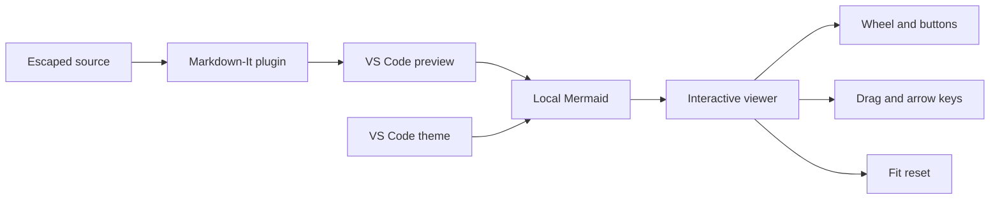

+++
title = "Better Markdown Preview Kitchen Sink"
unsafe = "<escaped>"
+++

# Better Markdown Preview

This document exercises **GFM**, https://example.com/a_(b), and
preview@example.com.

## Tasks and tables

- [x] Native-looking task
- [ ] Pending task

- Regular item in a mixed list
- [x] Task item aligned with its regular sibling
  - Nested regular item

| Feature       | State             |
| ------------- | ----------------- |
| Strikethrough | ~~old~~ current   |
| Theme         | VS Code variables |

## Alerts and notes

> [!NOTE]
> Alerts contain **normal block Markdown**.

> [!WARNING]
> The preview keeps source visible when a diagram fails.

Definition
: A definition-list value.

Footnotes work too.[^one]

[^one]: A footnote with a return link.

## Responsive columns

:::: {.columns}
::: {.column width=40%}

### Left column

Narrower weighted content.
:::
::: {.column}

### Right column

Flexible content that stacks on narrow previews.
:::
::::

## Native highlighting with presentation

```ts title="src/example.ts" {1,3-4} /needle/ showLineNumbers
const first = true;
const needle = 'highlight me'; // [!code ++]
const removed = false; // [!code --]
console.log(first, needle, removed);
```

## Mermaid



```Mermaid
This deliberately remains an ordinary code block.
```

## Long content

| A deliberately wide table                             | Second column | Third column | Fourth column |
| ----------------------------------------------------- | ------------- | ------------ | ------------- |
| Content wraps or scrolls without overflowing the page | B             | C            | D             |


